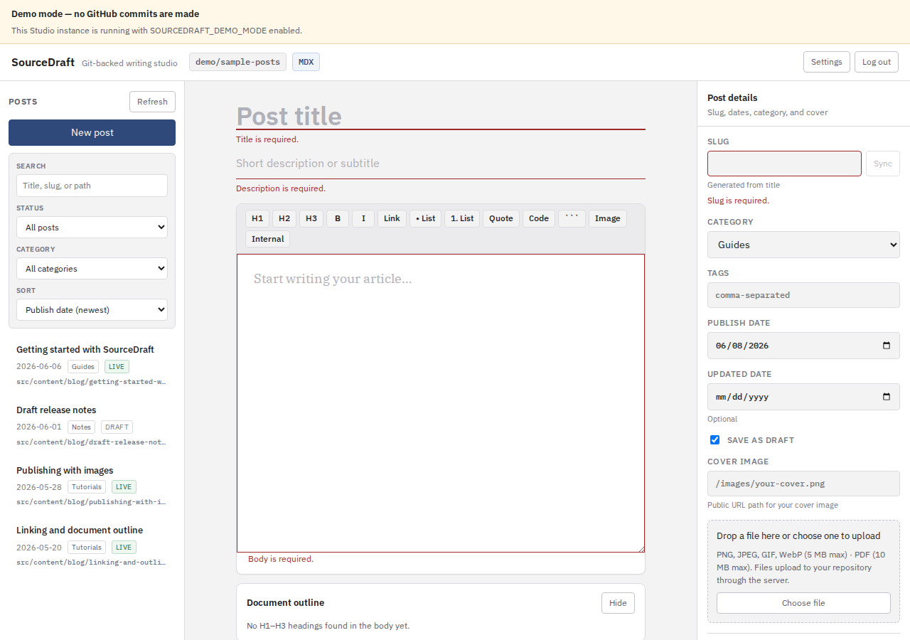
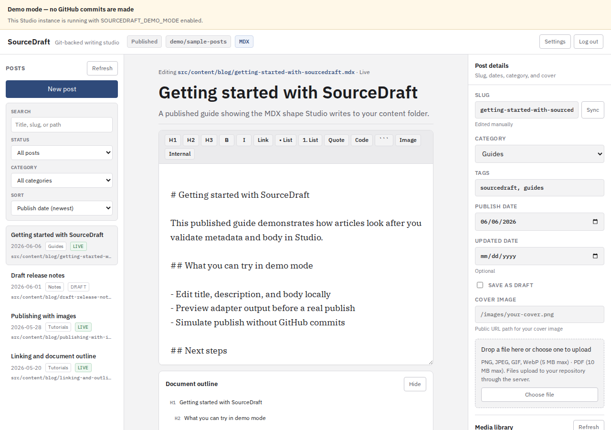
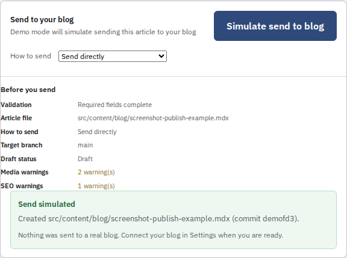

# SourceDraft

SourceDraft is a free, open-source **Git-based CMS** for Markdown and MDX publishing. You write in the browser with a Tiptap editor and slash commands, upload images, run content QA checks, preview the generated file, and publish to a Git repository or remote CMS (WordPress, Ghost).

Licensed under [AGPL-3.0-or-later](LICENSE).

**Project status:** SourceDraft is an early local/private MVP for Git-backed Markdown and MDX publishing. It is usable for solo writing and GitHub commits, but it is not a hosted CMS, multi-user product, or finished SaaS. See [docs/project-status.md](docs/project-status.md) and [CHANGELOG.md](CHANGELOG.md).

SourceDraft began as an internal tool for [QuBrite.com](https://qubrite.com) and is published here for anyone running a similar static-site workflow. QuBrite is the origin story, not a dependency — you point SourceDraft at your own repository and config.

## Screenshots



| | |
|---|---|
|  |  |

More views (toolbar, autosave, media library, content quality, preview, setup health): [docs/screenshots.md](docs/screenshots.md). Regenerate with `pnpm screenshots:generate`.

## What is SourceDraft?

SourceDraft is not WordPress and not a hosted website builder. It is a local **Studio** (editor) plus a small **publish API** that commits content and media to your target — GitHub, GitLab, Bitbucket, WordPress, or Ghost.

Your static site still builds and deploys exactly as before. SourceDraft creates or updates `.mdx` or `.md` files (via adapters) in the folder you configure, or pushes posts to a remote CMS API. Images can commit to your repo, upload to Cloudinary, or (experimentally) target S3-compatible storage.

## Who is this for?

**Bloggers and writers** on Git-backed static sites who want one place to draft posts without hand-editing frontmatter and Git commands.

**Developers** who want a shared article schema, Markdown/MDX adapters, and room to add more publishing targets later.

**Not a fit yet** if you need hosted multi-user accounts, OAuth, or a built-in site generator in this repository.

## What it does today

- Edit articles in Studio with a **Tiptap rich editor**, **slash commands**, and **source mode** for raw Markdown/MDX
- List and edit existing posts from your GitHub `contentDir`
- Validate fields against a universal article schema
- **Content QA** — non-blocking warnings for SEO, alt text, headings, links, and body length
- **Publish checklist** — validation status, output path, publish mode, and warnings before publish
- Preview Markdown or MDX adapter output and target file path before publishing
- Publish to Git hosts (GitHub, GitLab, Bitbucket) or remote CMS APIs (WordPress, Ghost)
- **GitHub PR publishing** — direct commit, pull request, or draft pull request for protected branches
- Upload images to git `mediaDir`, Cloudinary, or (experimental) S3-compatible storage
- Optional deploy hooks after publish (Vercel, Netlify, Cloudflare Pages, generic)
- **Setup detection** — scan local project files and suggest adapter, content, and media paths
- **Content audit** — read-only scan of existing posts (frontmatter, duplicate slugs, complex MDX)
- Configure paths, adapter, and categories in `sourcedraft.config.json`
- Protect Studio with a server-side admin password
- **Demo mode** — explore Studio with sample posts without GitHub credentials
- **Setup health** — Settings panel checks for missing config (no secrets exposed)

## What it does not do yet

- Host your website or run your Astro build
- OAuth, user accounts, role-based access, or hosted multi-tenant Studio
- Full S3/R2 media upload (`s3-compatible` validates config only; use Cloudinary or git media today)
- Post list in Studio for Bitbucket, WordPress, and Ghost publishers

Eight adapters ship today — see [docs/adapters.md](docs/adapters.md). See [docs/project-status.md](docs/project-status.md) for the full shipped vs experimental list.

## How publishing works

1. You finish a valid article in Studio and click **Publish**.
2. The **publish API** (server only) validates the article again.
3. The configured **adapter** builds the file (YAML frontmatter + body) as `.mdx` or `.md`.
4. The configured **publisher** sends content to your target — Git file commit or remote CMS API.
5. For Git publishers, your CI or build step picks up the new file from `contentDir`.

API tokens never reach the browser. They are read from `.env` on the server when you publish or upload media.

Details: [docs/publishers.md](docs/publishers.md) · [docs/git-publishers.md](docs/git-publishers.md) · [docs/wordpress.md](docs/wordpress.md) · [docs/ghost.md](docs/ghost.md)

**Compatibility (summary)**

| | Adapters (8) | Publishers (5) | Media (3) | Deploy hooks (4) |
|---|--------------|----------------|-----------|------------------|
| **Shipped** | Astro MDX, Markdown, Next.js MDX, Hugo, Eleventy/Jekyll, Docusaurus, MkDocs, Nuxt Content | GitHub, GitLab, Bitbucket, WordPress, Ghost | Git repo, Cloudinary, S3-compatible† | Generic, Vercel, Netlify, Cloudflare Pages |
| **Notes** | Plugin loader for custom adapters | Git: list posts (GH/GL); Bitbucket publish only; WP/Ghost API publish | †S3 upload not implemented yet | Optional `DEPLOY_HOOK_URL` after publish |

Full matrices: [adapters](docs/adapters.md) · [publishers](docs/publishers.md) · [media](docs/media.md) · [deploy-hooks](docs/deploy-hooks.md) · [quickstart recipes](docs/quickstart-recipes.md)

## Quickstart

Requirements: Node.js 22+, pnpm 11+

```bash
git clone https://github.com/bnz183/SourceDraft.git
cd SourceDraft
pnpm install
pnpm setup    # guided wizard — or copy example files manually (below)
```

Or copy example files manually:

```bash
cp sourcedraft.config.example.json sourcedraft.config.json
cp .env.example .env
```

Edit `.env`:

```env
SOURCEDRAFT_ADMIN_PASSWORD=choose-a-local-password
GITHUB_TOKEN=your-github-token
GITHUB_OWNER=your-github-username-or-org
GITHUB_REPO=your-site-repo
```

Start Studio (UI + publish API):

```bash
pnpm dev
```

Sign in, click **New post**, preview the output, publish. The file lands at `contentDir/<slug>.mdx` or `.md` depending on your adapter (default: `src/content/blog/`).

**Try without GitHub:** set `SOURCEDRAFT_DEMO_MODE=true` in `.env`, or leave GitHub vars empty and click **Explore demo mode** on the sign-in screen. Demo content reloads from repository fixtures on each API start. See [docs/demo-mode.md](docs/demo-mode.md).

Validate config: `pnpm validate:config` · Wizard details: [docs/setup-wizard.md](docs/setup-wizard.md) · Full walkthrough: [docs/getting-started.md](docs/getting-started.md)

## Beginner path

If someone technical already installed SourceDraft and pointed it at your blog repository, you only need:

1. The Studio address (usually `http://localhost:5173` on their machine)
2. The admin password they set in `.env`
3. Your site’s category list (from `sourcedraft.config.json`)

Then: sign in → open a post from the **Posts** sidebar, or click **New post** → fill in title, description, category, tags, and body → upload images if needed → check the preview → **Publish to GitHub**. Your post appears as a file in the blog repo; the normal site build deploys it.

You do not edit GitHub by hand or run terminal commands for each post. If publish is disabled, ask your technical contact to check `.env` (GitHub token and repo) and that Studio is running with `pnpm dev`.

Plain-language guide: [docs/non-technical-overview.md](docs/non-technical-overview.md)

## Security note

MVP password auth is intended for local/private use. Do not expose Studio publicly without HTTPS, stronger auth, and deployment hardening.

Details: [docs/security.md](docs/security.md)

## Configuration: two files, two jobs

| | `sourcedraft.config.json` | `.env` |
|---|---------------------------|--------|
| **Purpose** | Project settings safe to commit | Secrets and private targets |
| **Examples** | `contentDir`, `mediaDir`, `publicMediaPath`, `categories`, `adapter` | `GITHUB_TOKEN`, `GITHUB_OWNER`, `GITHUB_REPO`, `SOURCEDRAFT_ADMIN_PASSWORD` |
| **Shared in git?** | Yes (copy from `sourcedraft.config.example.json`) | Never |

Optional env vars (`CMS_CONTENT_DIR`, `CMS_MEDIA_DIR`, `CMS_PUBLIC_MEDIA_PATH`, `CMS_ADAPTER`, etc.) can override values from the JSON file. Secrets always stay in `.env`.

`mediaDir` is where images are committed in your site repo. `publicMediaPath` is the URL path Studio inserts into posts (for example `/images`).

Reference: [docs/configuration.md](docs/configuration.md)

## Astro integration example

[examples/astro-blog/](examples/astro-blog/) is a **folder layout example** — not a runnable Astro site. It shows where files go, a sample published `.mdx`, and matching config. Read its README before copying paths into your own blog repo.

## Contributing

Issues and pull requests are welcome. Read [CONTRIBUTING.md](CONTRIBUTING.md) for local setup, commands, and security reminders.

## Documentation

- [Getting started](docs/getting-started.md)
- [Quickstart recipes](docs/quickstart-recipes.md) — Astro+GitHub, Hugo+GitLab, WordPress, Cloudinary, deploy hooks, …
- [Plugins](docs/plugins.md)
- [SEO fields](docs/seo-fields.md)
- [Demo mode](docs/demo-mode.md)
- [Non-technical overview](docs/non-technical-overview.md) — for writers
- [Publishers overview](docs/publishers.md)
- [Git publishing (GitHub, GitLab, Bitbucket)](docs/git-publishers.md)
- [WordPress publishing](docs/wordpress.md)
- [Ghost publishing](docs/ghost.md)
- [Deploy hooks](docs/deploy-hooks.md)
- [GitHub publishing](docs/github-publishing.md)
- [GitHub PR publishing](docs/github-pr-publishing.md)
- [Editor and source mode](docs/editor.md)
- [Setup detection](docs/setup-detection.md)
- [Content QA](docs/content-qa.md)
- [Media uploads](docs/media.md)
- [Configuration](docs/configuration.md)
- [Astro integration example](docs/astro-blog-example.md)
- [Architecture](docs/architecture.md)
- [Adapters](docs/adapters.md)
- [Project status](docs/project-status.md)
- [How SourceDraft compares](docs/comparison.md) — Decap, Tina, CloudCannon, WordPress, Ghost
- [Roadmap](docs/roadmap.md)
- [Contributing roadmap](docs/contributing-roadmap.md) — good first issues
- [Manual acceptance test](docs/manual-acceptance-test.md)
- [Smoke tests (Playwright)](docs/getting-started.md#smoke-tests-playwright)
- [Release checklist](RELEASE_CHECKLIST.md)
- [Security](docs/security.md)
- [Screenshots guide](docs/screenshots.md)
- [Changelog](CHANGELOG.md)

## License

[AGPL-3.0-or-later](LICENSE)
